# 04 — Database Design

> **The migrations are authoritative.** The DDL below explains the design.
> The schema that actually runs lives in `supabase/migrations/`, and
> `npm run validate:migrations` applies it to a real Postgres on every push.
> Where the two disagree, the migration is correct and this document is stale.

Supabase / PostgreSQL. Normalised, RLS-enforced, API-first so Android consumes
the identical schema.

---

## 1. Conventions

| Convention | Detail |
|---|---|
| Primary keys | `uuid` via `gen_random_uuid()`. Never expose sequential IDs in URLs — they leak business volume. |
| Tenancy | `organization_id uuid NOT NULL` on **every** tenant table, always indexed, always in the RLS predicate. |
| Branch scoping | `branch_id` on operational records (sales, sessions, stock). Not on catalogue records (products are org-wide; *stock* is per-warehouse). |
| Money | `numeric(14,2)`. **Never `float`/`double`.** Rounding errors in a ledger are unrecoverable. |
| Quantity | `numeric(14,3)` — weight-sold goods need decimals (1.250 kg). |
| Unit cost | `numeric(14,4)` — extra precision, because averages divide. |
| Timestamps | `timestamptz`, always. §"today's sales" is computed in the branch timezone, never server-local. |
| Soft delete | `deleted_at timestamptz` on catalogue/parties. Hard delete only on genuinely orphanable rows. |
| Audit columns | `created_at`, `updated_at`, `created_by`. `updated_at` maintained by trigger. |
| Naming | snake_case, plural tables, singular enums. |

### Why quantities are `numeric(14,3)`

A butcher sells 1.250 kg. A hardware store sells 2.5 m of cable. If quantity
is an integer, those shops cannot exist on the platform — and §"Universal
retail support" fails on day one. Making it decimal everywhere costs nothing
for shops that only sell whole units.

---

## 2. The default-variant rule

**Every product has at least one variant row.**

A product with no options gets a single anonymous variant flagged
`is_default = true`. "Milk 1 Litre" has one variant; "T-shirt" has eighteen.

Consequences:

- `stock_balances`, `stock_movements`, `sale_items`, `purchase_items` all
  reference `variant_id NOT NULL`. No nullable FK, no `COALESCE` branches.
- One code path for stock math. The POS cart doesn't care whether variants
  are visible.
- Adding variants to an existing product later is a data migration, not a
  schema migration.
- The universal product model (§10, §11) stays genuinely universal.

This single decision removes a large class of null-handling bugs from the
inventory engine. It is the highest-leverage choice in the schema.

---

## 3. ERD

```mermaid
erDiagram
    organizations ||--o{ branches : has
    organizations ||--o{ warehouses : has
    organizations ||--o{ registers : has
    organizations ||--o{ products : owns
    organizations ||--o{ customers : owns
    organizations ||--o{ suppliers : owns
    organizations ||--o{ payment_methods : configures
    organizations ||--o{ plugins : installs
    branches ||--o{ registers : has
    branches ||--o{ register_sessions : opens
    branches ||--o{ users : staffs
    warehouses ||--o{ stock_balances : holds
    warehouses ||--o{ stock_movements : records

    products ||--|{ product_variants : "has ≥1"
    products }o--|| product_categories : in
    products }o--o| product_brands : by
    products ||--o{ product_barcodes : scanned_as
    product_variants ||--o{ stock_balances : balanced_by
    product_variants ||--o{ stock_movements : moved_by
    product_variants ||--o{ sale_items : sold_in
    product_variants ||--o{ purchase_items : bought_in

    sales ||--|{ sale_items : contains
    sales ||--o{ sale_payments : paid_by
    sales }o--o| customers : for
    sales }o--|| registers : at
    sales ||--o{ sale_returns : refunded_by
    sale_returns ||--|{ sale_return_items : contains

    purchases ||--|{ purchase_items : contains
    purchases ||--o{ purchase_payments : paid_by
    purchases }o--|| suppliers : from

    roles ||--o{ role_permissions : grants
    permissions ||--o{ role_permissions : granted_by
    users ||--o{ user_roles : holds
    roles ||--o{ user_roles : assigned_in

    expenses }o--|| expense_categories : in
    outbox }o--|| organizations : for
    audit_logs }o--|| organizations : for

    organizations ||--o{ user_organizations : has
    users ||--o{ user_organizations : joins
    users ||--o{ user_roles : holds
    organizations ||--o{ taxes : defines
    products }o--o| taxes : taxed_by
    organizations ||--o{ product_units : defines
    products }o--o| product_units : measured_in
    organizations ||--o{ warehouses : has
    stock_transfers ||--|{ stock_transfer_items : contains
    product_variants ||--o{ stock_transfer_items : moves
    sale_returns ||--o{ sale_return_payments : refunded_via
    product_option_types ||--o{ product_option_values : offers
```



The diagram is a summary, not the full schema. Omitted for readability are
`product_images` (variant image list) and `sequences` (per-organization
counter for invoice/return numbers, see §8). All 43 public tables are
defined in §4–§11 and created by `supabase/migrations/`.

---

## 4. Schema — tenancy & identity

```sql
CREATE TABLE organizations (
  id            uuid PRIMARY KEY DEFAULT gen_random_uuid(),
  name          text NOT NULL,
  slug          text NOT NULL UNIQUE,
  shop_type     text,                    -- key into shop_categories taxonomy
  currency      char(3) NOT NULL DEFAULT 'BDT',
  timezone      text NOT NULL DEFAULT 'Asia/Dhaka',
  locale        text NOT NULL DEFAULT 'en',
  logo_url      text,
  status        text NOT NULL DEFAULT 'active'
                  CHECK (status IN ('active','suspended','closed')),
  settings      jsonb NOT NULL DEFAULT '{}',   -- typed by core/settings
  created_at    timestamptz NOT NULL DEFAULT now(),
  updated_at    timestamptz NOT NULL DEFAULT now()
);

CREATE TABLE branches (
  id              uuid PRIMARY KEY DEFAULT gen_random_uuid(),
  organization_id uuid NOT NULL REFERENCES organizations(id) ON DELETE CASCADE,
  name            text NOT NULL,
  code            text NOT NULL,
  address         text,
  phone           text,
  email           text,
  timezone        text,                  -- overrides org if set
  is_primary      boolean NOT NULL DEFAULT false,
  deleted_at      timestamptz,
  created_at      timestamptz NOT NULL DEFAULT now(),
  UNIQUE (organization_id, code)
);
CREATE INDEX branches_org_idx ON branches(organization_id) WHERE deleted_at IS NULL;

CREATE TABLE warehouses (
  id              uuid PRIMARY KEY DEFAULT gen_random_uuid(),
  organization_id uuid NOT NULL REFERENCES organizations(id) ON DELETE CASCADE,
  branch_id       uuid REFERENCES branches(id) ON DELETE SET NULL,
  name            text NOT NULL,
  code            text NOT NULL,
  is_retail_floor boolean NOT NULL DEFAULT false,  -- the shop floor itself
  deleted_at      timestamptz,
  created_at      timestamptz NOT NULL DEFAULT now(),
  UNIQUE (organization_id, code)
);

CREATE TABLE registers (
  id              uuid PRIMARY KEY DEFAULT gen_random_uuid(),
  organization_id uuid NOT NULL REFERENCES organizations(id) ON DELETE CASCADE,
  branch_id       uuid NOT NULL REFERENCES branches(id) ON DELETE CASCADE,
  name            text NOT NULL,
  code            text NOT NULL,
  is_active       boolean NOT NULL DEFAULT true,
  UNIQUE (organization_id, code)
);

CREATE TABLE register_sessions (
  id              uuid PRIMARY KEY DEFAULT gen_random_uuid(),
  organization_id uuid NOT NULL REFERENCES organizations(id) ON DELETE CASCADE,
  register_id     uuid NOT NULL REFERENCES registers(id),
  branch_id       uuid NOT NULL REFERENCES branches(id),
  opened_by       uuid NOT NULL REFERENCES auth.users(id),
  closed_by       uuid REFERENCES auth.users(id),
  opened_at       timestamptz NOT NULL DEFAULT now(),
  closed_at       timestamptz,
  opening_cash    numeric(14,2) NOT NULL DEFAULT 0,
  closing_cash    numeric(14,2),
  expected_cash   numeric(14,2),
  variance        numeric(14,2),
  cash_in         numeric(14,2) NOT NULL DEFAULT 0,   -- manual top-ups
  cash_out        numeric(14,2) NOT NULL DEFAULT 0,   -- manual payouts
  sales_cash      numeric(14,2) NOT NULL DEFAULT 0,   -- derived
  refund_cash     numeric(14,2) NOT NULL DEFAULT 0,
  expense_cash    numeric(14,2) NOT NULL DEFAULT 0,
  note            text
);
-- One open session per register, enforced by the database.
CREATE UNIQUE INDEX one_open_session_per_register
  ON register_sessions(register_id) WHERE closed_at IS NULL;
```

That partial unique index is the whole §25 concurrency story. Two cashiers
cannot open the same drawer; the second `INSERT` fails with a clear error.

---

## 5. Schema — RBAC

```sql
CREATE TABLE permissions (
  id          uuid PRIMARY KEY DEFAULT gen_random_uuid(),
  key         text NOT NULL UNIQUE,      -- 'sales.refund', 'repair.orders.create'
  label       text NOT NULL,
  category    text NOT NULL,             -- 'sales','inventory','plugins',…
  plugin_id   text,                      -- null for core permissions
  description text
);

CREATE TABLE roles (
  id              uuid PRIMARY KEY DEFAULT gen_random_uuid(),
  organization_id uuid NOT NULL REFERENCES organizations(id) ON DELETE CASCADE,
  key             text NOT NULL,         -- 'owner','admin','cashier',…
  name            text NOT NULL,
  is_system       boolean NOT NULL DEFAULT false,  -- cannot delete/rename
  created_at      timestamptz NOT NULL DEFAULT now(),
  UNIQUE (organization_id, key)
);

CREATE TABLE role_permissions (
  role_id       uuid NOT NULL REFERENCES roles(id) ON DELETE CASCADE,
  permission_id uuid NOT NULL REFERENCES permissions(id) ON DELETE CASCADE,
  PRIMARY KEY (role_id, permission_id)
);

-- A user's membership in an organization. The RLS root — see §9.
CREATE TABLE user_organizations (
  user_id         uuid NOT NULL REFERENCES auth.users(id) ON DELETE CASCADE,
  organization_id uuid NOT NULL REFERENCES organizations(id) ON DELETE CASCADE,
  is_active       boolean NOT NULL DEFAULT true,
  created_at      timestamptz NOT NULL DEFAULT now(),
  PRIMARY KEY (user_id, organization_id)
);

-- Role assignment, scoped per org AND per branch.
-- branch_id NULL = applies to all branches (owner/admin).
CREATE TABLE user_roles (
  id              uuid PRIMARY KEY DEFAULT gen_random_uuid(),
  user_id         uuid NOT NULL REFERENCES auth.users(id) ON DELETE CASCADE,
  organization_id uuid NOT NULL REFERENCES organizations(id) ON DELETE CASCADE,
  branch_id       uuid REFERENCES branches(id) ON DELETE CASCADE,
  role_id         uuid NOT NULL REFERENCES roles(id) ON DELETE CASCADE,
  granted_by      uuid REFERENCES auth.users(id),
  granted_at      timestamptz NOT NULL DEFAULT now(),
  UNIQUE (user_id, organization_id, branch_id, role_id)
);
```

Why `user_organizations` exists separately from `user_roles`: RLS needs a
cheap, non-recursive way to answer "which orgs can this user see?" If that
question required joining `user_roles → roles → role_permissions`, every
policy on every table would recurse into three more tables. See
[09](./09-risks-and-decisions.md) #3.

---

## 6. Schema — catalogue

```sql
CREATE TABLE product_categories (
  id              uuid PRIMARY KEY DEFAULT gen_random_uuid(),
  organization_id uuid NOT NULL REFERENCES organizations(id) ON DELETE CASCADE,
  parent_id       uuid REFERENCES product_categories(id) ON DELETE SET NULL,
  name            text NOT NULL,
  slug            text NOT NULL,
  sort_order      int NOT NULL DEFAULT 0,
  is_active       boolean NOT NULL DEFAULT true,
  deleted_at      timestamptz,
  UNIQUE (organization_id, parent_id, slug)
);
-- Cycle-free tree, enforced.
ALTER TABLE product_categories
  ADD CONSTRAINT categories_no_self_parent CHECK (parent_id <> id);

CREATE TABLE product_brands (
  id              uuid PRIMARY KEY DEFAULT gen_random_uuid(),
  organization_id uuid NOT NULL REFERENCES organizations(id) ON DELETE CASCADE,
  name            text NOT NULL,
  deleted_at      timestamptz,
  UNIQUE (organization_id, name)
);

CREATE TABLE product_units (
  id              uuid PRIMARY KEY DEFAULT gen_random_uuid(),
  organization_id uuid NOT NULL REFERENCES organizations(id) ON DELETE CASCADE,
  name            text NOT NULL,         -- 'Each','kg','Litre','Dozen','Metre'
  symbol          text NOT NULL,         -- 'ea','kg','L','dz','m'
  is_decimal      boolean NOT NULL DEFAULT false,  -- weight-sold?
  deleted_at      timestamptz,
  UNIQUE (organization_id, name)
);

CREATE TABLE products (
  id                uuid PRIMARY KEY DEFAULT gen_random_uuid(),
  organization_id   uuid NOT NULL REFERENCES organizations(id) ON DELETE CASCADE,
  category_id       uuid REFERENCES product_categories(id),
  brand_id          uuid REFERENCES product_brands(id),
  unit_id           uuid REFERENCES product_units(id),
  name              text NOT NULL,
  sku               text,
  description       text,
  selling_price     numeric(14,2) NOT NULL DEFAULT 0 CHECK (selling_price >= 0),
  cost_price        numeric(14,4) NOT NULL DEFAULT 0 CHECK (cost_price >= 0),
  wholesale_price   numeric(14,2),
  tax_id            uuid,                         -- see §8
  tax_inclusive     boolean NOT NULL DEFAULT false,
  reorder_point     numeric(14,3) NOT NULL DEFAULT 0,
  allow_negative    boolean NOT NULL DEFAULT false,
  track_stock       boolean NOT NULL DEFAULT true,  -- services don't track
  is_active         boolean NOT NULL DEFAULT true,
  image_url         text,
  -- Plugin-owned sparse attributes. Typed by field descriptors (§05).
  metadata          jsonb NOT NULL DEFAULT '{}',
  -- Maintained by trigger from name + sku + brand + variant barcodes.
  search_text       text,
  deleted_at        timestamptz,
  created_at        timestamptz NOT NULL DEFAULT now(),
  updated_at        timestamptz NOT NULL DEFAULT now(),
  created_by        uuid REFERENCES auth.users(id)
);
CREATE INDEX products_org_active_idx
  ON products(organization_id, is_active) WHERE deleted_at IS NULL;
CREATE INDEX products_category_idx ON products(category_id);

CREATE TABLE product_variants (
  id              uuid PRIMARY KEY DEFAULT gen_random_uuid(),
  organization_id uuid NOT NULL REFERENCES organizations(id) ON DELETE CASCADE,
  product_id      uuid NOT NULL REFERENCES products(id) ON DELETE CASCADE,
  is_default      boolean NOT NULL DEFAULT false,
  sku             text,
  name_suffix     text,                  -- 'Red / M'
  -- {"Colour":"Red","Size":"M"} — keys come from product_option_types
  option_values   jsonb NOT NULL DEFAULT '{}',
  price_override  numeric(14,2),         -- null = inherit product.selling_price
  cost_override   numeric(14,4),
  image_url       text,
  is_active       boolean NOT NULL DEFAULT true,
  deleted_at      timestamptz,
  created_at      timestamptz NOT NULL DEFAULT now()
);
-- Exactly one default variant per product.
CREATE UNIQUE INDEX one_default_variant_per_product
  ON product_variants(product_id) WHERE is_default;

CREATE TABLE product_barcodes (
  id              uuid PRIMARY KEY DEFAULT gen_random_uuid(),
  organization_id uuid NOT NULL REFERENCES organizations(id) ON DELETE CASCADE,
  variant_id      uuid NOT NULL REFERENCES product_variants(id) ON DELETE CASCADE,
  code            text NOT NULL,
  is_primary      boolean NOT NULL DEFAULT false,
  created_at      timestamptz NOT NULL DEFAULT now(),
  UNIQUE (organization_id, code)         -- a barcode maps to one thing
);
CREATE INDEX barcodes_code_idx ON product_barcodes(organization_id, code);

-- Option definitions, only used when the Variants plugin is on.
CREATE TABLE product_option_types (
  id              uuid PRIMARY KEY DEFAULT gen_random_uuid(),
  organization_id uuid NOT NULL REFERENCES organizations(id) ON DELETE CASCADE,
  name            text NOT NULL,         -- 'Size','Colour'
  sort_order      int NOT NULL DEFAULT 0,
  UNIQUE (organization_id, name)
);
CREATE TABLE product_option_values (
  id           uuid PRIMARY KEY DEFAULT gen_random_uuid(),
  option_type_id uuid NOT NULL REFERENCES product_option_types(id) ON DELETE CASCADE,
  value        text NOT NULL,
  sort_order   int NOT NULL DEFAULT 0,
  UNIQUE (option_type_id, value)
);

CREATE TABLE product_images (
  id           uuid PRIMARY KEY DEFAULT gen_random_uuid(),
  variant_id   uuid NOT NULL REFERENCES product_variants(id) ON DELETE CASCADE,
  url          text NOT NULL,
  sort_order   int NOT NULL DEFAULT 0,
  created_at   timestamptz NOT NULL DEFAULT now()
);
```

### Product search

```sql
CREATE EXTENSION IF NOT EXISTS pg_trgm;

-- Maintained by trigger, not a generated column, so it can join brand +
-- variant barcodes + SKUs.
CREATE OR REPLACE FUNCTION refresh_product_search_text() RETURNS trigger AS $$
BEGIN
  NEW.search_text := lower(
    coalesce(NEW.name,'') || ' ' ||
    coalesce(NEW.sku,'') || ' ' ||
    coalesce((SELECT name FROM product_brands WHERE id = NEW.brand_id),'') || ' ' ||
    coalesce((SELECT string_agg(v.sku || ' ' || b.code, ' ')
              FROM product_variants v
              LEFT JOIN product_barcodes b ON b.variant_id = v.id
              WHERE v.product_id = NEW.id), '')
  );
  RETURN NEW;
END $$ LANGUAGE plpgsql;

CREATE TRIGGER products_search_text_tgr
  BEFORE INSERT OR UPDATE ON products
  FOR EACH ROW EXECUTE FUNCTION refresh_product_search_text();

-- Trigram handles "sam a15" → "samsung galaxy a15".
CREATE INDEX products_trgm_idx ON products USING gin (search_text gin_trgm_ops);
-- Prefix/exact scan handling.
CREATE INDEX products_barcode_idx ON product_barcodes USING gin (code gin_trgm_ops);
```

Search strategy in order: exact barcode match → SKU exact → trigram
similarity on `search_text`. Trigram is cheap enough at shop scale; do not
add a search service until a shop exceeds ~50k products.

---

## 7. Schema — the stock ledger

Two tables. One is append-only history, one is materialised current state.

```sql
CREATE TYPE stock_movement_type AS ENUM (
  'OPENING_STOCK',
  'PURCHASE',
  'SALE',
  'RETURN_IN',
  'RETURN_OUT',
  'ADJUSTMENT_IN',
  'ADJUSTMENT_OUT',
  'TRANSFER_IN',
  'TRANSFER_OUT',
  'DAMAGE',
  'LOSS',
  'EXPIRED',
  'COUNT',
  'PRODUCTION_IN',
  'PRODUCTION_OUT'
);

-- APPEND ONLY. No UPDATE, no DELETE. Enforced by trigger.
CREATE TABLE stock_movements (
  id              uuid PRIMARY KEY DEFAULT gen_random_uuid(),
  organization_id uuid NOT NULL REFERENCES organizations(id) ON DELETE CASCADE,
  warehouse_id    uuid NOT NULL REFERENCES warehouses(id),
  variant_id      uuid NOT NULL REFERENCES product_variants(id),
  product_id      uuid NOT NULL REFERENCES products(id),  -- denormalised for reporting
  type            stock_movement_type NOT NULL,
  quantity        numeric(14,3) NOT NULL CHECK (quantity > 0),  -- always positive
  direction       smallint NOT NULL CHECK (direction IN (1,-1)), -- sign lives here
  before_quantity numeric(14,3) NOT NULL,
  after_quantity  numeric(14,3) NOT NULL,
  unit_cost       numeric(14,4) NOT NULL DEFAULT 0,
  -- Provenance: what caused this movement.
  reference_type  text,      -- 'sale','purchase','transfer','adjustment',…
  reference_id    uuid,
  user_id         uuid REFERENCES auth.users(id),
  note            text,
  created_at      timestamptz NOT NULL DEFAULT now(),
  CHECK (after_quantity = before_quantity + (quantity * direction))
);
CREATE INDEX movements_variant_time_idx
  ON stock_movements(variant_id, created_at DESC);
CREATE INDEX movements_reference_idx
  ON stock_movements(reference_type, reference_id);
CREATE INDEX movements_org_time_idx
  ON stock_movements(organization_id, created_at DESC);

CREATE OR REPLACE FUNCTION prevent_movement_mutation() RETURNS trigger AS $$
BEGIN
  RAISE EXCEPTION 'stock_movements is append-only';
END $$ LANGUAGE plpgsql;

CREATE TRIGGER movements_immutable
  BEFORE UPDATE OR DELETE ON stock_movements
  FOR EACH ROW EXECUTE FUNCTION prevent_movement_mutation();

-- Materialised current state.
CREATE TABLE stock_balances (
  organization_id uuid NOT NULL REFERENCES organizations(id) ON DELETE CASCADE,
  warehouse_id    uuid NOT NULL REFERENCES warehouses(id) ON DELETE CASCADE,
  variant_id      uuid NOT NULL REFERENCES product_variants(id) ON DELETE CASCADE,
  product_id      uuid NOT NULL REFERENCES products(id) ON DELETE CASCADE,
  quantity        numeric(14,3) NOT NULL DEFAULT 0,
  avg_unit_cost   numeric(14,4) NOT NULL DEFAULT 0,
  reserved_qty    numeric(14,3) NOT NULL DEFAULT 0,   -- held by open orders
  updated_at      timestamptz NOT NULL DEFAULT now(),
  PRIMARY KEY (warehouse_id, variant_id)
);
CREATE INDEX balances_org_lowstock_idx
  ON stock_balances(organization_id, quantity);

CREATE TABLE stock_transfers (
  id                uuid PRIMARY KEY DEFAULT gen_random_uuid(),
  organization_id   uuid NOT NULL REFERENCES organizations(id) ON DELETE CASCADE,
  from_warehouse_id uuid NOT NULL REFERENCES warehouses(id),
  to_warehouse_id   uuid NOT NULL REFERENCES warehouses(id),
  status            text NOT NULL DEFAULT 'pending'
                      CHECK (status IN ('pending','in_transit','received','cancelled')),
  note              text,
  created_by        uuid REFERENCES auth.users(id),
  created_at        timestamptz NOT NULL DEFAULT now(),
  received_at       timestamptz,
  CHECK (from_warehouse_id <> to_warehouse_id)
);
CREATE TABLE stock_transfer_items (
  id          uuid PRIMARY KEY DEFAULT gen_random_uuid(),
  transfer_id uuid NOT NULL REFERENCES stock_transfers(id) ON DELETE CASCADE,
  variant_id  uuid NOT NULL REFERENCES product_variants(id),
  quantity    numeric(14,3) NOT NULL CHECK (quantity > 0)
);
```

### Answering "why 37 units?"

```sql
SELECT created_at, type, quantity * direction AS delta,
       before_quantity, after_quantity, reference_type, reference_id, note
FROM stock_movements
WHERE variant_id = $1 AND warehouse_id = $2
ORDER BY created_at DESC;
```

Every row is a complete explanation. `before`/`after` plus the `CHECK`
constraint means a corrupted ledger is *detectable* — a row that doesn't
balance is impossible to insert.

### Costing: weighted average

On stock-in of `q` units at cost `c`, current balance `Q` at average `A`:

```
new_avg = (Q * A + q * c) / (Q + q)
```

On stock-out: `unit_cost = A` (unchanged), quantity decreases.

Chosen over FIFO because it needs no batch ordering, is trivially auditable,
and matches how small shops actually think. **FIFO is a plugin** that adds
`stock_cost_layers` and overrides the costing function — the ledger schema
supports both without change.

**This needs your confirmation.** It changes what "profit" means on every
report, and switching later requires a valuation migration.

---

## 8. Schema — selling & buying

```sql
CREATE TYPE sale_status AS ENUM (
  'DRAFT','HELD','COMPLETED','PARTIALLY_PAID',
  'CANCELLED','REFUNDED','PARTIALLY_REFUNDED'
);

CREATE TABLE sales (
  id              uuid PRIMARY KEY DEFAULT gen_random_uuid(),
  organization_id uuid NOT NULL REFERENCES organizations(id) ON DELETE CASCADE,
  branch_id       uuid NOT NULL REFERENCES branches(id),
  register_id     uuid REFERENCES registers(id),
  session_id      uuid REFERENCES register_sessions(id),
  invoice_no      text NOT NULL,
  customer_id     uuid REFERENCES customers(id),
  status          sale_status NOT NULL DEFAULT 'DRAFT',
  currency        char(3) NOT NULL,
  subtotal        numeric(14,2) NOT NULL DEFAULT 0,
  discount_total  numeric(14,2) NOT NULL DEFAULT 0,
  discount_type   text,                  -- 'FLAT','PERCENT'
  discount_value  numeric(14,4),
  tax_total       numeric(14,2) NOT NULL DEFAULT 0,
  total           numeric(14,2) NOT NULL DEFAULT 0,
  paid_total      numeric(14,2) NOT NULL DEFAULT 0,
  change_due      numeric(14,2) NOT NULL DEFAULT 0,
  cogs            numeric(14,2) NOT NULL DEFAULT 0,   -- captured at sale time
  profit          numeric(14,2) GENERATED ALWAYS AS (total - tax_total - cogs) STORED,
  note            text,
  metadata        jsonb NOT NULL DEFAULT '{}',
  created_by      uuid REFERENCES auth.users(id),
  created_at      timestamptz NOT NULL DEFAULT now(),
  updated_at      timestamptz NOT NULL DEFAULT now(),
  completed_at    timestamptz,
  UNIQUE (organization_id, invoice_no)
);
CREATE INDEX sales_org_time_idx ON sales(organization_id, created_at DESC);
CREATE INDEX sales_branch_day_idx ON sales(branch_id, created_at DESC);
CREATE INDEX sales_customer_idx ON sales(customer_id);
CREATE INDEX sales_status_idx ON sales(organization_id, status);

CREATE TABLE sale_items (
  id              uuid PRIMARY KEY DEFAULT gen_random_uuid(),
  sale_id         uuid NOT NULL REFERENCES sales(id) ON DELETE CASCADE,
  organization_id uuid NOT NULL REFERENCES organizations(id) ON DELETE CASCADE,
  variant_id      uuid NOT NULL REFERENCES product_variants(id),
  product_id      uuid NOT NULL REFERENCES products(id),
  -- Snapshot at time of sale. Never a live FK lookup — prices change.
  product_name    text NOT NULL,
  variant_name    text,
  sku             text,
  quantity        numeric(14,3) NOT NULL CHECK (quantity > 0),
  unit_price      numeric(14,2) NOT NULL,
  unit_cost       numeric(14,4) NOT NULL DEFAULT 0,
  discount_type   text,
  discount_value  numeric(14,4),
  discount_total  numeric(14,2) NOT NULL DEFAULT 0,
  tax_rate        numeric(6,4) NOT NULL DEFAULT 0,
  tax_total       numeric(14,2) NOT NULL DEFAULT 0,
  line_total      numeric(14,2) NOT NULL,
  line_cogs       numeric(14,2) NOT NULL DEFAULT 0,
  note            text
);
CREATE INDEX sale_items_sale_idx ON sale_items(sale_id);
CREATE INDEX sale_items_product_idx ON sale_items(product_id, sale_id);

CREATE TABLE sale_payments (
  id              uuid PRIMARY KEY DEFAULT gen_random_uuid(),
  sale_id         uuid NOT NULL REFERENCES sales(id) ON DELETE CASCADE,
  organization_id uuid NOT NULL REFERENCES organizations(id) ON DELETE CASCADE,
  method_id       uuid NOT NULL REFERENCES payment_methods(id),
  amount          numeric(14,2) NOT NULL,   -- negative = refund
  reference       text,                     -- txn id, last4, etc.
  received_at     timestamptz NOT NULL DEFAULT now(),
  received_by     uuid REFERENCES auth.users(id)
);

CREATE TABLE sale_returns (
  id              uuid PRIMARY KEY DEFAULT gen_random_uuid(),
  sale_id         uuid NOT NULL REFERENCES sales(id),
  organization_id uuid NOT NULL REFERENCES organizations(id) ON DELETE CASCADE,
  branch_id       uuid NOT NULL REFERENCES branches(id),
  return_no       text NOT NULL,
  reason          text,
  restock         boolean NOT NULL DEFAULT true,
  refund_total    numeric(14,2) NOT NULL DEFAULT 0,
  created_by      uuid REFERENCES auth.users(id),
  created_at      timestamptz NOT NULL DEFAULT now(),
  UNIQUE (organization_id, return_no)
);
CREATE TABLE sale_return_items (
  id          uuid PRIMARY KEY DEFAULT gen_random_uuid(),
  return_id   uuid NOT NULL REFERENCES sale_returns(id) ON DELETE CASCADE,
  sale_item_id uuid NOT NULL REFERENCES sale_items(id),
  quantity    numeric(14,3) NOT NULL CHECK (quantity > 0),
  refund_amount numeric(14,2) NOT NULL
);
CREATE TABLE sale_return_payments (
  id         uuid PRIMARY KEY DEFAULT gen_random_uuid(),
  return_id  uuid NOT NULL REFERENCES sale_returns(id) ON DELETE CASCADE,
  method_id  uuid NOT NULL REFERENCES payment_methods(id),
  amount     numeric(14,2) NOT NULL CHECK (amount < 0),  -- money out
  reference  text
);

CREATE TYPE purchase_status AS ENUM
  ('DRAFT','ORDERED','PARTIALLY_RECEIVED','RECEIVED','CANCELLED');

CREATE TABLE purchases (
  id              uuid PRIMARY KEY DEFAULT gen_random_uuid(),
  organization_id uuid NOT NULL REFERENCES organizations(id) ON DELETE CASCADE,
  branch_id       uuid NOT NULL REFERENCES branches(id),
  warehouse_id    uuid NOT NULL REFERENCES warehouses(id),
  supplier_id     uuid REFERENCES suppliers(id),
  reference_no    text,
  invoice_no      text NOT NULL,
  status          purchase_status NOT NULL DEFAULT 'DRAFT',
  subtotal        numeric(14,2) NOT NULL DEFAULT 0,
  discount_total  numeric(14,2) NOT NULL DEFAULT 0,
  tax_total       numeric(14,2) NOT NULL DEFAULT 0,
  total           numeric(14,2) NOT NULL DEFAULT 0,
  paid_total      numeric(14,2) NOT NULL DEFAULT 0,
  expected_at     date,
  note            text,
  created_by      uuid REFERENCES auth.users(id),
  created_at      timestamptz NOT NULL DEFAULT now(),
  UNIQUE (organization_id, invoice_no)
);
CREATE TABLE purchase_items (
  id            uuid PRIMARY KEY DEFAULT gen_random_uuid(),
  purchase_id   uuid NOT NULL REFERENCES purchases(id) ON DELETE CASCADE,
  variant_id    uuid NOT NULL REFERENCES product_variants(id),
  product_name  text NOT NULL,
  quantity      numeric(14,3) NOT NULL CHECK (quantity > 0),
  received_qty  numeric(14,3) NOT NULL DEFAULT 0,
  unit_cost     numeric(14,4) NOT NULL,
  tax_rate      numeric(6,4) NOT NULL DEFAULT 0,
  line_total    numeric(14,2) NOT NULL
);
CREATE TABLE purchase_payments (
  id          uuid PRIMARY KEY DEFAULT gen_random_uuid(),
  purchase_id uuid NOT NULL REFERENCES purchases(id) ON DELETE CASCADE,
  method_id   uuid NOT NULL REFERENCES payment_methods(id),
  amount      numeric(14,2) NOT NULL,
  reference   text,
  paid_at     timestamptz NOT NULL DEFAULT now()
);
```

Note `line_cogs` and `unit_cost` snapshotted onto `sale_items`. Profit is
computed **at sale time** from the cost then in effect. If cost prices are
edited next month, historical profit reports must not change. This is a
frequent and serious bug in naive POS systems.

### Invoice numbering

```sql
CREATE TABLE sequences (
  organization_id uuid NOT NULL REFERENCES organizations(id) ON DELETE CASCADE,
  scope           text NOT NULL,        -- 'invoice:2026', 'return:2026'
  last_value      bigint NOT NULL DEFAULT 0,
  PRIMARY KEY (organization_id, scope)
);
```

Inside `complete_sale`:

```sql
UPDATE sequences
   SET last_value = last_value + 1
 WHERE organization_id = v_org AND scope = 'invoice:' || to_char(now(),'YYYY')
RETURNING last_value;
```

The `UPDATE ... RETURNING` takes a row lock, so concurrent cashiers get
distinct, gap-free numbers. Two shops can both have invoice `INV-0001`
because the scope is per-organization.

---

## 9. Row Level Security

### The helpers

```sql
CREATE SCHEMA IF NOT EXISTS app;

-- SECURITY DEFINER + fixed search_path: reads the junction table without
-- re-entering RLS. This is what prevents policy recursion.
CREATE OR REPLACE FUNCTION app.current_org_ids()
RETURNS uuid[] LANGUAGE sql STABLE SECURITY DEFINER SET search_path = public AS $$
  SELECT coalesce(array_agg(organization_id), '{}')
    FROM user_organizations
   WHERE user_id = auth.uid() AND is_active
$$;

CREATE OR REPLACE FUNCTION app.in_org(p_org uuid)
RETURNS boolean LANGUAGE sql STABLE AS $$
  SELECT p_org = ANY(app.current_org_ids())
$$;

-- Branch scope comes from a JWT claim, so Android sets it the same way.
CREATE OR REPLACE FUNCTION app.current_branch_id()
RETURNS uuid LANGUAGE sql STABLE AS $$
  SELECT nullif(
    coalesce(auth.jwt()->'app_metadata'->>'active_branch_id',''), ''
  )::uuid
$$;

CREATE OR REPLACE FUNCTION app.has_permission(p_key text)
RETURNS boolean LANGUAGE sql STABLE SECURITY DEFINER SET search_path = public AS $$
  SELECT EXISTS (
    SELECT 1
      FROM user_roles ur
      JOIN role_permissions rp ON rp.role_id = ur.role_id
      JOIN permissions p       ON p.id = rp.permission_id
     WHERE ur.user_id = auth.uid()
       AND ur.organization_id = ANY(app.current_org_ids())
       AND (ur.branch_id IS NULL OR ur.branch_id = app.current_branch_id())
       AND (p.key = p_key
            OR p.key = '*'
            OR p.key = split_part(p_key,'.',1) || '.*')
  )
$$;
```

### The policy template

Applied to every tenant table:

```sql
ALTER TABLE products ENABLE ROW LEVEL SECURITY;

CREATE POLICY products_select ON products FOR SELECT
  USING (app.in_org(organization_id) AND deleted_at IS NULL);

CREATE POLICY products_insert ON products FOR INSERT
  WITH CHECK (app.in_org(organization_id) AND app.has_permission('products.create'));

CREATE POLICY products_update ON products FOR UPDATE
  USING (app.in_org(organization_id) AND app.has_permission('products.edit'))
  WITH CHECK (app.in_org(organization_id));

CREATE POLICY products_delete ON products FOR DELETE
  USING (app.in_org(organization_id) AND app.has_permission('products.delete'));
```

The junction table itself needs a permissive read for one's own row:

```sql
ALTER TABLE user_organizations ENABLE ROW LEVEL SECURITY;
CREATE POLICY uo_select_own ON user_organizations FOR SELECT
  USING (user_id = auth.uid());
```

### Rules

1. **Every table gets RLS.** No exceptions. A forgotten `ENABLE ROW LEVEL
   SECURITY` is an open table — Supabase's default is deny, but only once
   enabled.
2. **Writes to stock and money go through `SECURITY DEFINER` RPCs** owned by
   `postgres`, which do their own explicit org checks. Clients cannot call
   the tables directly for those paths.
3. **Service role bypasses RLS.** It is only ever present in Edge Functions.
   `VITE_` env vars are public by definition — the anon key is fine, the
   service key is not (§44).
4. **Branch isolation** is enforced in the RPC layer and in policies on
   operational tables (`sales`, `register_sessions`, `stock_balances`).

---

## 10. Plugin-owned tables

Plugins add tables via their own migrations. Naming: `plg_<plugin_id>_<table>`.

```sql
-- plugins/batch-expiry/migrations/001.sql
CREATE TABLE plg_batch_stock_batches (
  id              uuid PRIMARY KEY DEFAULT gen_random_uuid(),
  organization_id uuid NOT NULL REFERENCES organizations(id) ON DELETE CASCADE,
  warehouse_id    uuid NOT NULL REFERENCES warehouses(id),
  variant_id      uuid NOT NULL REFERENCES product_variants(id) ON DELETE CASCADE,
  batch_no        text NOT NULL,
  expiry_date     date,
  quantity        numeric(14,3) NOT NULL DEFAULT 0,
  unit_cost       numeric(14,4) NOT NULL DEFAULT 0,
  UNIQUE (warehouse_id, variant_id, batch_no)
);
CREATE INDEX plg_batch_expiry_idx
  ON plg_batch_stock_batches(organization_id, expiry_date);
```

Rationale for prefix-in-`public` rather than one Postgres schema per plugin:
PostgREST exposure, RLS grants and Supabase migrations all work with zero
extra configuration. A schema-per-plugin layout is cleaner at 50+ plugins and
is a documented future migration, not a v1 requirement.

Plugin tables must always carry `organization_id` and get RLS. The plugin
loader verifies this on install and refuses a migration that creates a table
without it.

---

## 11. Platform tables

```sql
CREATE TABLE plugins (
  id              uuid PRIMARY KEY DEFAULT gen_random_uuid(),
  organization_id uuid NOT NULL REFERENCES organizations(id) ON DELETE CASCADE,
  plugin_key      text NOT NULL,             -- 'pharmacy'
  version         text NOT NULL,
  enabled         boolean NOT NULL DEFAULT false,
  config          jsonb NOT NULL DEFAULT '{}',
  enabled_at      timestamptz,
  enabled_by      uuid REFERENCES auth.users(id),
  created_at      timestamptz NOT NULL DEFAULT now(),
  UNIQUE (organization_id, plugin_key)
);

-- Transactional outbox — see doc 02 §3.
CREATE TABLE outbox (
  id              uuid PRIMARY KEY DEFAULT gen_random_uuid(),
  organization_id uuid NOT NULL REFERENCES organizations(id) ON DELETE CASCADE,
  event_type      text NOT NULL,
  aggregate_type  text NOT NULL,
  aggregate_id    uuid,
  payload         jsonb NOT NULL DEFAULT '{}',
  created_at      timestamptz NOT NULL DEFAULT now(),
  processed_at    timestamptz
);
CREATE INDEX outbox_unprocessed_idx
  ON outbox(created_at) WHERE processed_at IS NULL;

CREATE TABLE audit_logs (
  id              bigint GENERATED ALWAYS AS IDENTITY PRIMARY KEY,
  organization_id uuid NOT NULL REFERENCES organizations(id) ON DELETE CASCADE,
  actor_id        uuid REFERENCES auth.users(id),
  action          text NOT NULL,         -- 'product.price_changed'
  entity_type     text NOT NULL,
  entity_id       uuid,
  before          jsonb,
  after           jsonb,
  ip              inet,
  user_agent      text,
  metadata        jsonb,
  created_at      timestamptz NOT NULL DEFAULT now()
);
CREATE INDEX audit_org_time_idx ON audit_logs(organization_id, created_at DESC);

CREATE TABLE payment_methods (
  id              uuid PRIMARY KEY DEFAULT gen_random_uuid(),
  organization_id uuid NOT NULL REFERENCES organizations(id) ON DELETE CASCADE,
  key             text NOT NULL,          -- 'cash','bkash','visa'
  name            text NOT NULL,
  type            text NOT NULL,          -- 'cash','mobile','card','bank','credit','other'
  is_cash         boolean NOT NULL DEFAULT false,  -- affects register expected cash
  is_active       boolean NOT NULL DEFAULT true,
  sort_order      int NOT NULL DEFAULT 0,
  icon            text,
  config          jsonb NOT NULL DEFAULT '{}',
  UNIQUE (organization_id, key)
);

CREATE TABLE taxes (
  id              uuid PRIMARY KEY DEFAULT gen_random_uuid(),
  organization_id uuid NOT NULL REFERENCES organizations(id) ON DELETE CASCADE,
  name            text NOT NULL,          -- 'VAT 5%','GST'
  rate            numeric(6,4) NOT NULL CHECK (rate >= 0 AND rate <= 100),
  is_inclusive    boolean NOT NULL DEFAULT false,
  applies_to      text NOT NULL DEFAULT 'products'
                    CHECK (applies_to IN ('products','services','both')),
  is_active       boolean NOT NULL DEFAULT true,
  UNIQUE (organization_id, name)
);

CREATE TABLE expense_categories (
  id              uuid PRIMARY KEY DEFAULT gen_random_uuid(),
  organization_id uuid NOT NULL REFERENCES organizations(id) ON DELETE CASCADE,
  name            text NOT NULL,
  is_system       boolean NOT NULL DEFAULT false,
  UNIQUE (organization_id, name)
);
CREATE TABLE expenses (
  id              uuid PRIMARY KEY DEFAULT gen_random_uuid(),
  organization_id uuid NOT NULL REFERENCES organizations(id) ON DELETE CASCADE,
  branch_id       uuid NOT NULL REFERENCES branches(id),
  category_id     uuid REFERENCES expense_categories(id),
  session_id      uuid REFERENCES register_sessions(id),
  amount          numeric(14,2) NOT NULL CHECK (amount > 0),
  method_id       uuid REFERENCES payment_methods(id),
  description     text,
  attachment_url  text,
  expense_date    date NOT NULL DEFAULT CURRENT_DATE,
  deleted_at      timestamptz,
  created_by      uuid REFERENCES auth.users(id),
  created_at      timestamptz NOT NULL DEFAULT now()
);

CREATE TABLE customers (
  id              uuid PRIMARY KEY DEFAULT gen_random_uuid(),
  organization_id uuid NOT NULL REFERENCES organizations(id) ON DELETE CASCADE,
  name            text NOT NULL,
  phone           text,
  email           text,
  address         text,
  date_of_birth   date,
  tax_id          text,
  credit_limit    numeric(14,2) NOT NULL DEFAULT 0,
  balance         numeric(14,2) NOT NULL DEFAULT 0,   -- maintained by RPC
  store_credit    numeric(14,2) NOT NULL DEFAULT 0,
  note            text,
  metadata        jsonb NOT NULL DEFAULT '{}',        -- loyalty etc. live here
  deleted_at      timestamptz,
  created_at      timestamptz NOT NULL DEFAULT now(),
  updated_at      timestamptz NOT NULL DEFAULT now()
);
CREATE INDEX customers_org_phone_idx ON customers(organization_id, phone);
CREATE INDEX customers_trgm_idx ON customers USING gin (name gin_trgm_ops);

CREATE TABLE suppliers (
  id              uuid PRIMARY KEY DEFAULT gen_random_uuid(),
  organization_id uuid NOT NULL REFERENCES organizations(id) ON DELETE CASCADE,
  name            text NOT NULL,
  phone           text,
  email           text,
  address         text,
  balance         numeric(14,2) NOT NULL DEFAULT 0,
  note            text,
  metadata        jsonb NOT NULL DEFAULT '{}',
  deleted_at      timestamptz,
  created_at      timestamptz NOT NULL DEFAULT now()
);
```

Loyalty gets its own tables via the loyalty plugin — `customers.metadata`
holds the cached points total for display, while
`plg_loyalty_accounts` / `plg_loyalty_transactions` hold the truth.

---

## 12. Indexing summary

| Query | Index |
|---|---|
| POS product search | `products_trgm_idx` (GIN), `products_barcode_idx` (GIN) |
| Stock ledger for a variant | `movements_variant_time_idx` |
| Today's sales for a branch | `sales_branch_day_idx` |
| Low stock list | `balances_org_lowstock_idx` joined to `products.reorder_point` |
| Audit trail | `audit_org_time_idx` |
| Barcode scan | `product_barcodes(organization_id, code)` unique |
| Unprocessed events | `outbox_unprocessed_idx` (partial) |
| Open register session | `one_open_session_per_register` (partial unique) |

Missing on purpose: no index on `sales.total` (range scans on money are rare
and low-value), no index on `metadata` until a plugin needs one, at which
point the plugin adds a GIN index on the specific JSON path it queries.

---

## 13. Migrations layout (§46)

```
supabase/
├── migrations/
│   ├── 20260923_001_extensions.sql      # pg_trgm, pgcrypto
│   ├── 20260923_002_tenancy.sql         # organizations, branches, warehouses
│   ├── 20260923_003_rbac.sql            # permissions, roles, user_organizations
│   ├── 20260923_004_app_helpers.sql     # app.current_org_ids, has_permission
│   ├── 20260923_005_catalogue.sql       # categories, brands, units, products, variants
│   ├── 20260923_006_stock.sql           # movements, balances, transfers
│   ├── 20260923_007_parties.sql         # customers, suppliers
│   ├── 20260923_008_money.sql           # payment_methods, taxes, expenses
│   ├── 20260923_009_sales.sql           # sales, items, payments, returns
│   ├── 20260923_010_purchases.sql
│   ├── 20260923_011_platform.sql        # plugins, outbox, audit_logs, sequences
│   ├── 20260923_012_rpc_sale.sql        # complete_sale, hold_sale, refund_sale
│   ├── 20260923_013_rpc_stock.sql       # adjust_stock, transfer_stock, receive_purchase
│   ├── 20260923_014_rpc_register.sql    # open_register, close_register, record_expense
│   ├── 20260923_015_rls.sql             # all policies
│   └── 20260923_016_reporting.sql       # dashboard_summary, report views
├── functions/                           # Edge Functions
├── seed/
│   ├── 001_permissions.sql
│   ├── 002_roles.sql
│   ├── 003_payment_methods.sql
│   ├── 004_categories.sql
│   ├── 005_units.sql
│   └── 006_demo_org.sql
└── config.toml
```

Numbered and ordered so a fresh `supabase db reset` reproduces the database
exactly. Never edit an applied migration — add a new one.
